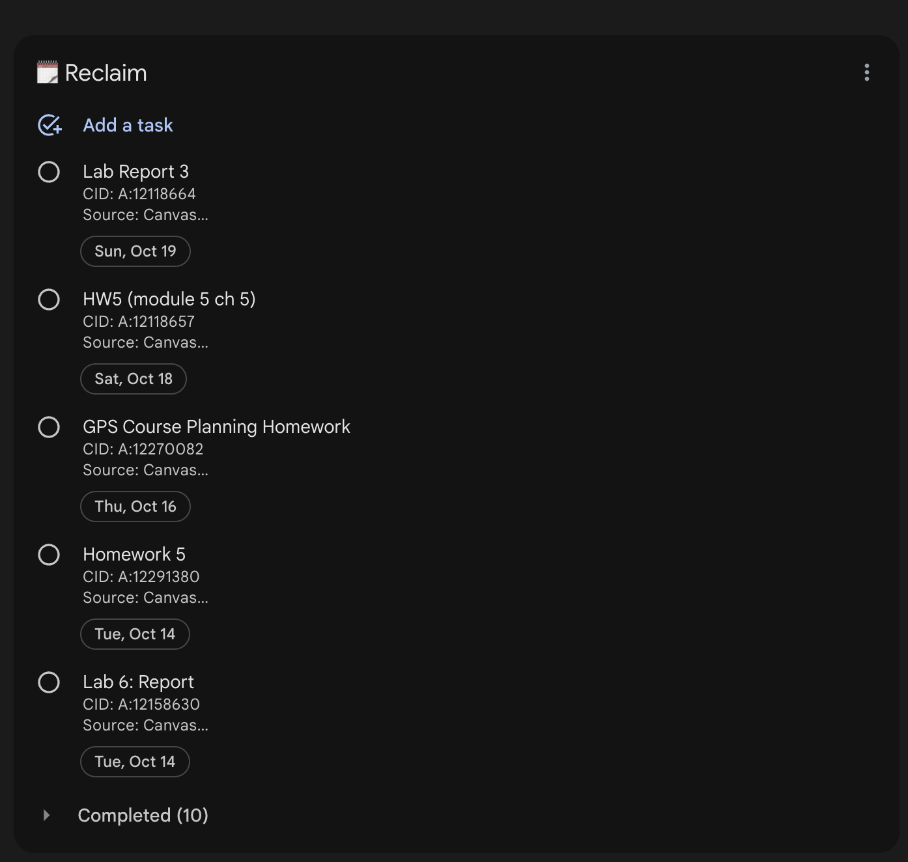

# Canvas LMS → Google Tasks Link

Sync your Canvas LMS To‑Do list to a Google Tasks list automatically. Built so tasks appear in tools like Reclaim.ai (which reads from Google Tasks) and flow onto your calendar.



## Features

- **Automatic sync**: Pulls Canvas To‑Dos and upserts them into a Google Tasks list.
- **Idempotent with stable CIDs**: Items are matched by an embedded `CID` so repeated runs don't duplicate.
- **Updates and auto‑complete**:
  - Updates title, due date, and notes when they change in Canvas.
  - Automatically completes Google Tasks that no longer appear in the Canvas To‑Do list.
- **Windowed look‑ahead**: Only sync items due within `WINDOW_DAYS` (default 30).
- **Plain, minimal code**: Easy to understand and self‑host.

## Requirements

- Node.js 18+ (for global `fetch` and modern runtime APIs)
- A Canvas LMS account and either:
  - A personal access token (fastest for individual use), or
  - A Canvas OAuth Developer Key if you're building a multi‑user app
- A Google Cloud project with the Google Tasks API enabled

## Installation

```bash
git clone https://github.com/<you>/canvaslms-googlecal-linker
cd canvaslms-googlecal-linker
npm install
```

## Configuration (.env)

Create a `.env` file in the project root with the following variables:

```env
# Canvas
CANVAS_BASE=https://your-school.instructure.com
CANVAS_TOKEN=your_canvas_access_token

# Google OAuth (from Google Cloud Console)
GOOGLE_CLIENT_ID=...
GOOGLE_CLIENT_SECRET=...
# Set after the first OAuth run (see below)
GOOGLE_REFRESH_TOKEN=UNDEFINED

# Optional
GOOGLE_TASKS_LIST_NAME=Canvas (auto)
WINDOW_DAYS=30
```

Notes:
- The app listens at `http://localhost:3000/oauth2callback` during the one‑time OAuth flow.
- If you use Google OAuth, add this exact Authorized redirect URI in your OAuth client.

## Google Cloud Setup (once)

1. In the Google Cloud Console, create a project (e.g., “CanvasLMS Google Tasks Link”).
2. Enable the “Google Tasks API”.
3. Create OAuth credentials (Web application).
4. On the Consent screen, add the `https://www.googleapis.com/auth/tasks` scope.
5. Add `http://localhost:3000/oauth2callback` as an Authorized redirect URI.
6. Copy your `GOOGLE_CLIENT_ID` and `GOOGLE_CLIENT_SECRET` into `.env`.

## First run: obtain a Google refresh token

On the very first run, leave `GOOGLE_REFRESH_TOKEN` unset or set to `UNDEFINED`. Then run:

```bash
npm run run
```

What happens:
- Your browser opens to Google's consent page.
- After approving, you're redirected back to `http://localhost:3000/oauth2callback`.
- The app prints a `GOOGLE_REFRESH_TOKEN`. Copy it into your `.env`.

Subsequent runs will use this refresh token to authenticate without prompting.

## Usage: run a sync

```bash
npm run run
```

Behavior:
- Creates (or reuses) the list named by `GOOGLE_TASKS_LIST_NAME`.
- Fetches Canvas To‑Dos via `GET /api/v1/users/self/todo`.
- Normalizes items and upserts into Google Tasks.
- Marks tasks as completed in Google if they are no longer present in Canvas.

## Refresh tokens: Testing vs Production

If your GitHub Action starts failing with “invalid_grant: Token has been expired or revoked”, your Google OAuth consent screen is likely in Testing mode. In Testing, Google refresh tokens expire after 7 days.

How to fix permanently:
- Publish the OAuth consent screen to Production (Google Cloud Console → APIs & Services → OAuth consent screen → Publish App).
- Re-run the local OAuth flow once to generate a new `GOOGLE_REFRESH_TOKEN`, then update your GitHub secret.
- Ensure you keep using the same OAuth client ID/secret. Rotating/deleting the OAuth client or switching projects will revoke existing refresh tokens.

Notes:
- For personal use, you can keep the app “unverified” in Production; you’ll see an unverified warning and be limited to 100 users, but tokens won’t auto-expire after 7 days.
- If you change your Google account password or manually revoke the app’s access, you’ll need to re-authorize to mint a new refresh token.